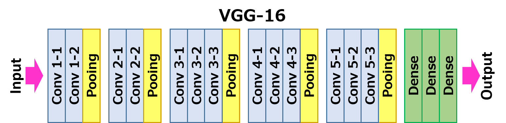

# PerceptualLossNetwork
This repository is for CS577 (Deep Learning) @ IIT
The work in this repository is based on the paper:

[Perceptual Losses for Real-Time Style Transfer and Super Resolution](https://arxiv.org/pdf/1603.08155v1.pdf)

```
@article{
title={Perceptual Losses for Real-Time Style Transfer and Super Resolution},
author={Justin Johnson, Alexandre Alahi, Li Fei-Fei},
publisher={Dept. of Computer Science, Stanford University},
year={2016}
}
```
This implementation was inspired from the offical [pytorch example](https://github.com/pytorch/examples/tree/master/fast_neural_style) from facebook research:


## Installation
### MacOS (CPU)
- Install conda 
- Set env by either:
    - Create conda enviornment: `conda create --name <env> --file macOS_local_req.txt`
    - Install into existing conda environment: `conda install -n <env_name> macOS_local_req.txt`

## Commands:
### Example to test the model ( stylize an image ) :
    python3 src/stylize.py --image test/COCO_train2014_000000363111.jpg --model trained_models/mosaic_id5320.pth

### To train a model from scratch
    python3 src/trainer.py --data-dir training_data/ --style style/mosaic.jpeg

### To train with checkpoints
    python3 src/trainer.py --data-dir training_data/ --style style/mosaic.jpeg --save 1 --checkpoints-path dir_to_save

### To retrain a model
    python3 src/trainer.py --data-dir training_data/ --style style/mosaic.jpeg --retrain 1 --retrain-model trained_models/tree_to_retrain.pth

### To visualize the losses
    python3 src/visualize_losses.py
    
## Perceptual Loss
### VGG16 Architecture:

